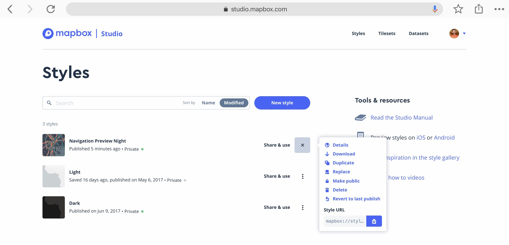

# 2. スタイルを変更する

地図のスタイルを自由に変更できるところが、Mapbox の大きな特徴です。スタイルを変更してみましょう。

[1. 地図を表示する](1_INSTALL.md)を実施してから行います

## 地図の表示領域を広げる

まずは、地図の大きさを広げましょう。index.html の中の、`<div id='map'` の部分が地図の領域なので、width と height を変更します。

`<div id='map' style='width: 800px; height: 600px;'></div>`

これで、少し地図が大きくなりました。


## カスタムスタイルを作る

Mapbox のデザインを変更する方法はいくつかありますが、このチュートリアルでは、Mapbox Studio を使います。ログインした状態で
[Mapbox Studio](https://studio.mapbox.com/) のページへアクセスします。

 

New Style を選択すると、元となるスタイルを選べます。好きな地図を選ぶと、マップスタイルの編集画面に移ります。


## 新しい地図を表示する

スタイルを編集する前に、先ほど作った地図を表示してみましょう。
スタイル一覧のページに戻り、Style URL をコピーします。



先ほどの index.html を開き、コピーした文字列（URI）で、 `style: 'mapbox://...'` の部分を差し替えます。
ブラウザからアクセスして、新しい地図のスタイルに変更されていれば成功です。

## デザインを変更する


### 表記を日本語に変更
デフォルトではラベル表記が英語なので、日本語表記に変更します。

変化がわかりやすいように、右側の地図を日本に移動しましょう。検索ボックス（Search Place）に東京を入力して移動できます。
スタイルの編集画面に移り、左側のパネルから、`Filter Layers` をつかい、`Filter by values` を選び、`{text fields}` を探します。
検索ボックスに name_en と入力すると、`Text field {name_en}` というフィルタが見つかるので、それを選択します。
すると、左側のスタイルが全てこの値を含んだものに絞り込まれます。それぞれを選択し、name_en の部分を name に変更します。
すべて変更したら Publish ボタンを押しましょう。

地図の中心点も、東京にしておきましょう。エディタ画面の地図内のボックス右下に、現在表示している場所の中心点の緯度経度が表示されていますので、これをコピーして、index.html の `style:..` 行に `center:[経度,緯度],` として設定します。
以下のようになるはずです。

```html
var map = new mapboxgl.Map({
container: 'map',
center: [139.750,35.676],
style: 'mapbox://styles/georepublic/......'
});
```

