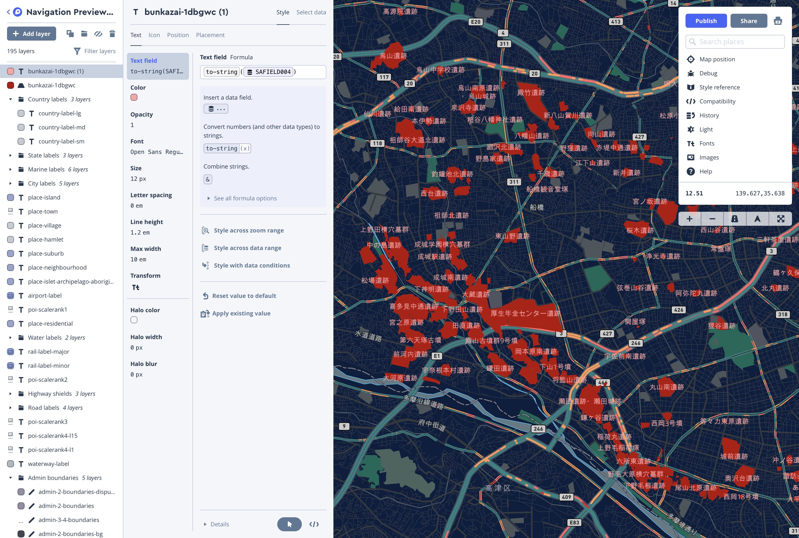
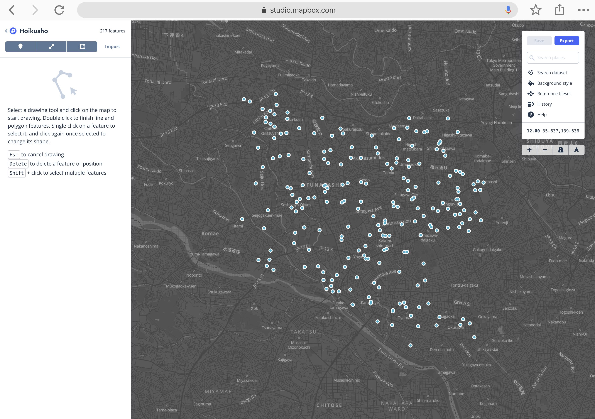

# オリジナルデータを登録する

いよいよ、自分で用意したデータを登録してみましょう。
[Dataset Editor](https://studio.mapbox.com/datasets/) から、データを登録できます。

Mapbox Studio から登録できるデータには、データセット(dataset) と、 タイルセット(tileset) という形式があります。

データセットからは、Point, Line, Polygon といったデータや属性(property)へアクセスでき、 共にMapbox Studio dataset editor や Datasets API 経由で編集をすることができます。

タイルセットは、ベクター形式の軽量なデータ集合で、高速な描画に最適化されています。読み取り専用で、Mapbox Studio 上からは編集できません。

更に詳細な比較については、[Mapboxのドキュメント](https://docs.mapbox.com/help/troubleshooting/uploads/)を見てください

## タイルセットを作る

オリジナルのデータを Mapbox Studio 上で表示するために、新たにタイルセット(tileset)を作ります。
タイルセットには、様々な地理空間情報が指定できますが、今回は[世田谷区GISオープンデータ](http://data-setagaya.opendata.arcgis.com/)にあるデータから、[埋蔵文化財包蔵地](http://data-setagaya.opendata.arcgis.com/datasets/%E5%9F%8B%E8%94%B5%E6%96%87%E5%8C%96%E8%B2%A1%E5%8C%85%E8%94%B5%E5%9C%B0)を表示してみましょう。

ダウンロード→シェープファイル を選択すると、シェープファイルが含まれたzipファイルをダウンロードできます。シェープファイル(Shapefile)とは、地理空間情報のフォーマットの一つで、ESRI社などの主要な地理情報ソフトウェアで使われるフォーマットです。
日本語ファイル名をタイルセットに登録すると文字化けするので、ダウンロードしたファイルの名前を Bunkazai.zip に変更します。

[Mapbox tilset editor](https://studio.mapbox.com/tilesets/)から `New tileset` を選択し、 Bunkazai.zip をアップロードします。
アップロードが完了すると、Mapbox Studio から登録したデータを使うことができます。

[Mapbox Studio](https://studio.mapbox.com/)から、作成中の地図を開き、左側のメニューから`+ Add layer` を選択すると、先程登録した Bunkazai という tileset を選べるようになっているはずです。
Bunkazai の下にあるデータを選択したのち、Style タブに切り替えると、描画色を変更することができます。

Shapefile には、ポリゴン以外の属性データも登録されています。各フィールドの詳細については、[データセットのページ](http://data-setagaya.opendata.arcgis.com/datasets/%E5%9F%8B%E8%94%B5%E6%96%87%E5%8C%96%E8%B2%A1%E5%8C%85%E8%94%B5%E5%9C%B0/data)で確認できます。ここでは、遺跡名称を地図上に表示してみましょう。タイルセット上では、SAFIELD004 として登録されています。

再度`Add layer` を行い、Bunkazai tileset を選択します。次に、現在 `Fill` となっている `Type` を、`Symbol` に変更すると、テキスト表記ができます。Style タブを開き、`Text field` の内容を設定します。`Insert a data field` から、属性として登録されている内容を選ぶことができますので、SAFIELD004 を選びます。

また、Color や Size を選択して、読みやすいスタイルに変更します。

合わせて、index.html を編集し、中心点の緯度経度も世田谷区にしておきましょう。(139.646,35.626)

一通り設定したら、Publish ボタンを押し、ブラウザ側で確認してみます。

## データセットを作る

地理情報を含んだデータをアップロードすることで、dataset を作成できます。
今回は保育所のデータセットを作ってみます。[保育所データ](http://data-setagaya.opendata.arcgis.com/datasets/%E4%BF%9D%E8%82%B2%E6%89%80)のページから、ダウンロード→スプレッドシートを選択すると、csvファイルをダウンロードできます。
データに含まれる緯度経度情報を指定するために、ダウンロードしたデータを一度テキストエディットで開いて、1行目の X,Y, の部分をLongitude, Latitude, に変更して保存します。

その後、[Mapbox Studio dataset editor](https://studio.mapbox.com/datasets/)から、先ほど作った csv ファイルをアップロードします。アップロードが完了したら、データセットの名前を入力(Hoikusho)して Confirm を押し、編集画面に移動します。

続いて、[幼稚園データ](http://data-setagaya.opendata.arcgis.com/datasets/%E5%B9%BC%E7%A8%9A%E5%9C%92)もダウンロードして、X,Y, を変更した後に、編集画面から import をします。これで、保育園と幼稚園の場所が含まれるデータセットができました。

## データセットをタイルセットに変換する

データセットをスタイルエディタ上で表示するためには、データセットをタイルセットに変換する必要があります。データセットの一覧画面に戻り、該当データセットのメニューから、`Export to tileset` を選択します。ポップアップウィンドウでは、`Export to a new tileset` を選択します。

## スタイルエディタから編集する

